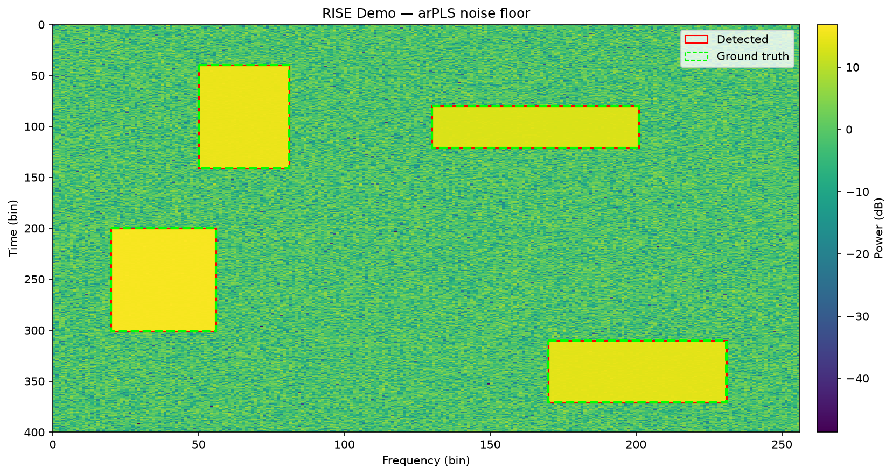

# PyRISE

A Python implementation of the **RISE** spectrum sensing algorithm — *Real-time Image processing for Spectral Energy detection and localization* (Tung et al., 2026).

PyRISE treats a radio spectrogram as an image and runs a lightweight classical computer vision pipeline to detect and localize signals in the time-frequency plane — no ML, no prior knowledge of signal types required.

> **Disclosure:** This codebase is AI-generated, written under the guidance of a DSP engineer. The algorithm faithfully follows the paper; the Python architecture and API are designed for experimentation and clarity rather than real-time performance.

---



*Synthetic demo: four injected signal blocks (green dashed = ground truth, red = RISE detections).*

---

## Pipeline

PyRISE runs four stages on a 2D time-frequency plot of shape `(T, F)`:

1. **Noise floor estimation** — time-averages the TF plot to a 1D PSD, then estimates the noise floor. Pluggable: use the built-in Savitzky-Golay smoother or drop in arPLS (or any callable you write).
2. **Adaptive binarization** — applies Otsu thresholding independently to each frequency column. No manual threshold tuning.
3. **Morphological operations** — 2D closing, 2D opening, then horizontal 1D opening to fill signal gaps and suppress noise speckles.
4. **Connected component labeling** — extracts a bounding box `(t0, t1, f0, f1)` for each detected energy block.

## Installation

**Tested on Python 3.10, 3.11, 3.12, 3.13, and 3.14.**

### From GitHub (recommended)

```bash
pip install git+https://github.com/TreyShenk/PyRISE.git
```

With the optional arPLS noise floor estimator:

```bash
pip install "pyrise[arpls] @ git+https://github.com/TreyShenk/PyRISE.git"
```

Using [uv](https://docs.astral.sh/uv/):

```bash
uv add git+https://github.com/TreyShenk/PyRISE.git
uv add "git+https://github.com/TreyShenk/PyRISE.git[arpls]"  # with arPLS
```

### From source

```bash
git clone git@github.com:TreyShenk/PyRISE.git
cd PyRISE
uv sync              # core deps
uv sync --extra arpls  # with arPLS support
```

## Usage

> **Note:** `tf_plot` must be in **linear power** (not dB). Convert with `10 ** (tf_db / 10)`.

### Basic detection

```python
import numpy as np
from pyrise import RISE

rise = RISE()
boxes = rise.run(tf_plot)  # tf_plot: np.ndarray shape (T, F), linear power

for b in boxes:
    print(f"Signal at t=[{b.t0},{b.t1}] f=[{b.f0},{b.f1}] (bin indices)")
```

### Swap the noise floor estimator

The `noise_floor_fn` parameter accepts any callable `(psd: np.ndarray) -> np.ndarray`:

```python
from functools import partial
from pyrise import RISE, sg_noise_floor, arpls_noise_floor

# Savitzky-Golay with a wider window (default)
rise = RISE(noise_floor_fn=partial(sg_noise_floor, window_length=21))

# arPLS — per-frequency baseline, better for sloped/shaped noise floors
rise = RISE(noise_floor_fn=arpls_noise_floor)

# Roll your own
def median_floor(psd):
    return np.full_like(psd, np.median(psd))

rise = RISE(noise_floor_fn=median_floor)
```

### Visualization

```python
from pyrise import plot_detections
import matplotlib.pyplot as plt

fig = plot_detections(tf_plot, boxes)

# With physical axis labels (MHz / ms)
fig = plot_detections(tf_plot, boxes, fs=100e6, fft_size=1024)

plt.show()
```

### Run the demo

```bash
uv run python demo.py
```

Generates a synthetic TF plot with four injected signal blocks, runs RISE, and saves `demo_output.png`.

## API Reference

### `RISE(noise_floor_fn, *, psd_offset, se_size_2d, se_size_1d)`

| Parameter | Default | Description |
|---|---|---|
| `noise_floor_fn` | `sg_noise_floor` | Noise floor estimator. Any `(psd) -> noise_floor` callable. |
| `psd_offset` | `0.0` | Additive offset (linear power) above the noise floor for column pruning. Raise to suppress false alarms. |
| `se_size_2d` | `3` | Side length of the square 2D morphological structuring element. |
| `se_size_1d` | `3` | Length of the horizontal 1D structuring element. |

**`RISE.run(tf_plot) -> list[BoundingBox]`** — runs the full pipeline. Input must be shape `(T, F)` in linear power.

### `BoundingBox(t0, t1, f0, f1)`

Frozen dataclass. All fields are inclusive bin indices. Convert to physical units:

```python
dt = fft_size / fs          # seconds per time bin
df = fs / fft_size          # Hz per frequency bin

t_start = box.t0 * dt
f_center = (box.f0 + box.f1) / 2 * df
```

### `plot_detections(tf_plot, boxes, *, ax, db, vmin, vmax, cmap, box_color, fs, fft_size, title)`

Plots the spectrogram with bounding boxes overlaid. Pass `fs` and `fft_size` for physical axis labels (MHz / ms). Returns the `matplotlib.Figure`.

## Reference

> Chung-Hsuan Tung, Zhenzhou Qi, Tingjun Chen. *RISE: Real-time Image Processing for Spectral Energy Detection and Localization.* arXiv:2603.20481, 2026.
>
> Open-source C++ implementation: https://github.com/functions-lab/rise
